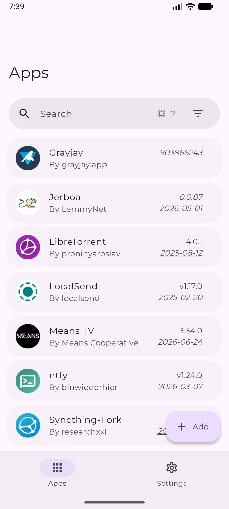
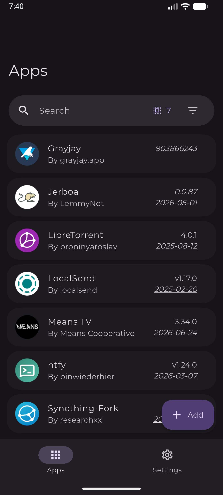
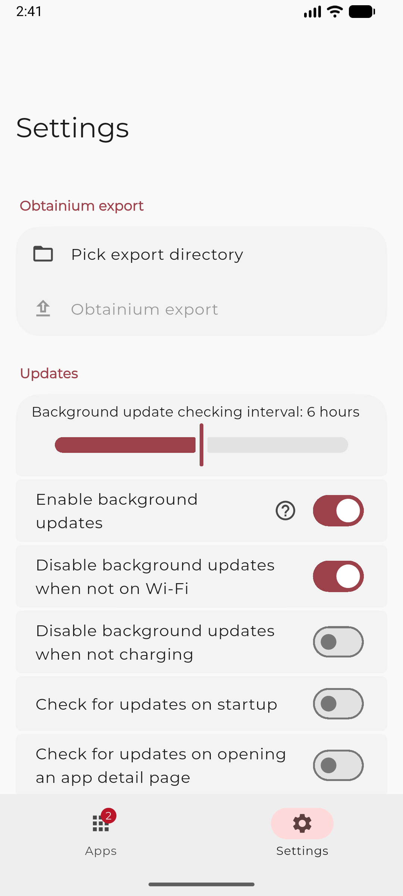
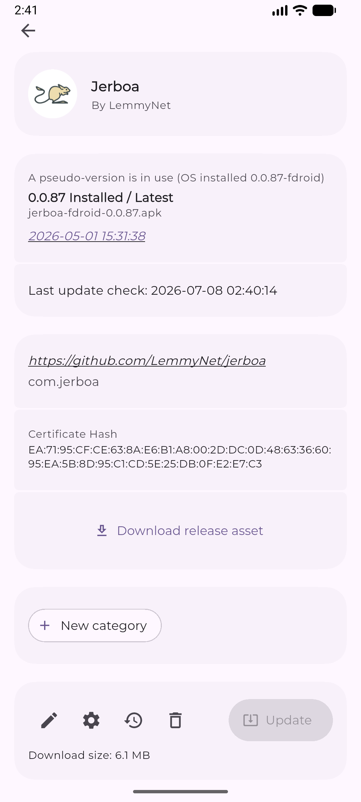
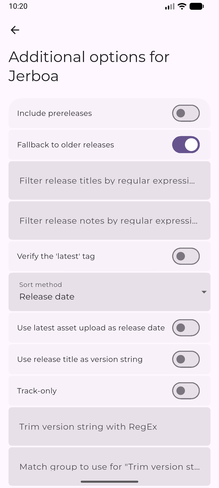
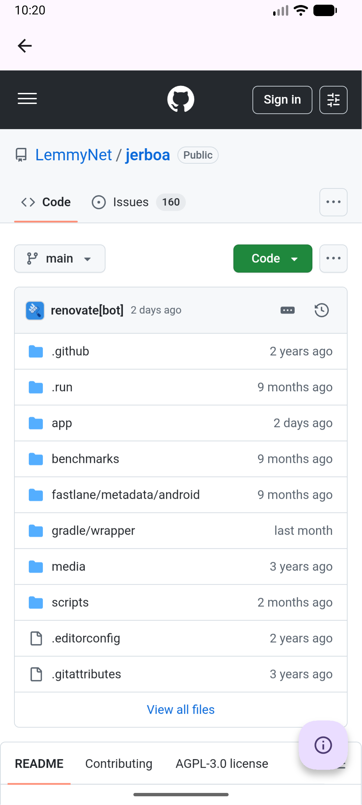

#  Obtainium+ (ObtainiumPlus)

Get Android app updates straight from the source, styled with modern aesthetics and advanced developer options.

Obtainium+ is a enhanced, telemetry-free fork of the original Obtainium client. It allows you to install and update apps directly from their releases pages, receive notifications when new releases are made available, and adds advanced diagnostic logging, reactive layout controls, and Google Play Store mirror integration.

---

### 🌟 Obtainium+ vs. Upstream Obtainium

| Feature | Upstream Obtainium | Obtainium+ |
| :--- | :--- | :--- |
| **User Interface** | Standard Flutter Material Design | Curated modern Glassmorphic design with dynamic HSL gradients, blurs, and premium typography. |
| **Play Store Support** | Direct APK links / Web scraper fallbacks | Full API Mirror Integration with support for custom **Anonymous Token Dispensers** and microG profiles. |
| **Developer Diagnostics** | Standard command logs | Real-time structured network logger (Talker Integration) and local Crash Statistics Dashboard. |
| **Settings Reactivity** | Requires app restarts for many switches | 100% reactive state management (`context.watch`) with instant, dynamic UI updates. |
| **Community Privacy** | Hardcoded default third-party servers | Telemetry-free and default-free (no hardcoded server pings) to protect community resources and guarantee privacy. |

---

## Key Additions in Obtainium+

### 🎨 Glassmorphic Interface & Premium Polish
*   **Modern Aesthetics:** Rebuilt the onboarding, cards, detail sheets, and settings headers to support smooth backdrop blurs, dynamic opacities, and premium HSL gradients.
*   **Visual Audit Resolution:** Completely removed solid, high-contrast panels and overwhelming card glow borders to preserve a cohesive glassmorphic look.

### 🔒 Anonymous Play Store Mirror Integration
*   **Custom Token Dispensers:** Configure your own self-hosted anonymous token dispenser URL or hook in a custom microG account to retrieve updates straight from Google Play.
*   **Telemetry-Free & Zero Defaults:** Contains absolutely no telemetry, and does not ship with any pre-configured default server URLs (such as `auroraoss.com`) to honor the maintainers' wishes and ensure maximum privacy.

### 🌐 Diagnostics & Live Log Viewers
*   **Talker Integration:** Real-time structured logger capturing network requests, errors, and system warnings on a dedicated, localized diagnostics screen.
*   **Crash Statistics:** A local crash statistics analyzer that tracks frequencies, error types, and logs without routing data to external services.

### 🔄 Dynamic Toggles & Providers
*   **Fully Reactive Engine:** Swapped out once-off reading routines for reactive providers (`context.watch`) on all layout settings, app bar styles, quick-action FAB menus, and bottom sheets so they update instantly.

---

## Currently supported App sources:
- Open Source - General:
  - [GitHub](https://github.com/)
  - [GitLab](https://gitlab.com/)
  - [Forgejo](https://forgejo.org/) ([Codeberg](https://codeberg.org/))
  - [F-Droid](https://f-droid.org/)
  - Third Party F-Droid Repos
  - [IzzyOnDroid](https://android.izzysoft.de/)
  - [SourceHut](https://git.sr.ht/)
- Other - General:
  - [APKPure](https://apkpure.net/)
  - [Aptoide](https://aptoide.com/)
  - [Uptodown](https://uptodown.com/)
  - [Huawei AppGallery](https://appgallery.huawei.com/)
  - [Tencent App Store](https://sj.qq.com/)
  - [vivo App Store (CN)](https://h5.appstore.vivo.com.cn/)
  - [RuStore](https://rustore.ru/)
  - [Farsroid](https://www.farsroid.com)
  - [CoolApk](https://coolapk.com/)
  - [RockMods](https://rockmods.net/)
  - [LiteAPKs](https://liteapks.com/)
  - [APK4Free](https://apk4free.net/)
  - Jenkins Jobs
  - [APKMirror](https://apkmirror.com/) (Track-Only)
- Other - App-Specific:
  - [Telegram App](https://telegram.org/)
  - [Neutron Code](https://neutroncode.com/)
- Direct APK Link
- "HTML" (Fallback): Any other URL that returns an HTML page with links to APK files

## Finding App Configurations

You can find crowdsourced app configurations at [apps.obtainium.imranr.dev](https://apps.obtainium.imranr.dev).

If you can't find the configuration for an app you want, feel free to leave a request on the [discussions page](https://github.com/ImranR98/apps.obtainium.imranr.dev/discussions/new?category=app-requests).

Or, contribute some configurations to the website by creating a PR at [this repo](https://github.com/ImranR98/apps.obtainium.imranr.dev).

## Installation

     
Verification info:
- Package ID: `dev.thejaustin.obtainium.plus`
- SHA-256 hash of signing certificate: `B3:53:60:1F:6A:1D:5F:D6:60:3A:E2:F5:0B:E8:0C:F3:01:36:7B:86:B6:AB:8B:1F:66:24:3D:A9:6C:D5:73:62`
- [PGP Public Key](https://keyserver.ubuntu.com/pks/lookup?search=contact%40imranr.dev&fingerprint=on&op=index) (to verify APK hashes)

### 🚀 Major Additions in the Latest Release:
*   **Default App Store Routing & Detection:** Auto-detects installed stores (F-Droid, Droidify, Aurora Store) on the details sheet. Users can choose to open an app in their preferred store or configure a default store to automatically route the main Install/Update buttons.
*   **Customizable Dispenser Ban Warning Threshold:** Added a settings slider to adjust the bulk update threshold (from 1 to 50 apps). Alerts trigger when automated checks exceed this value to guard your IP from Google Play ban triggers.
*   **Material 3 Expressive (M3E) Dynamic Alignment:** Ensured all newly added compartments, bubble buttons, dialogs, and text fields scale beautifully using M3E tokens and responsive dimensions. Fixed layout wrappers to prevent text or button overlaps.

## Screenshots

|  |            |     |
| ------------------------------------------------------ | ----------------------------------------------------------------------- | -------------------------------------------------------------------- |
|    |  |  |

---

— Antigravity (Gemini Agent)
